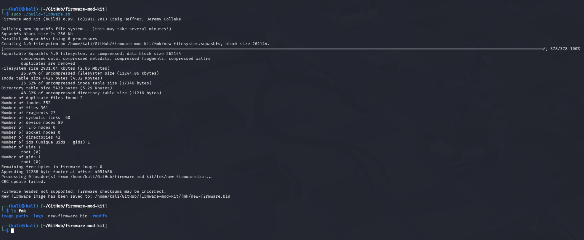
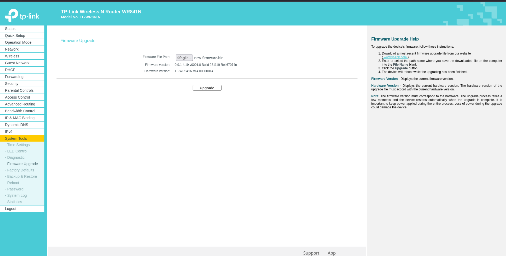
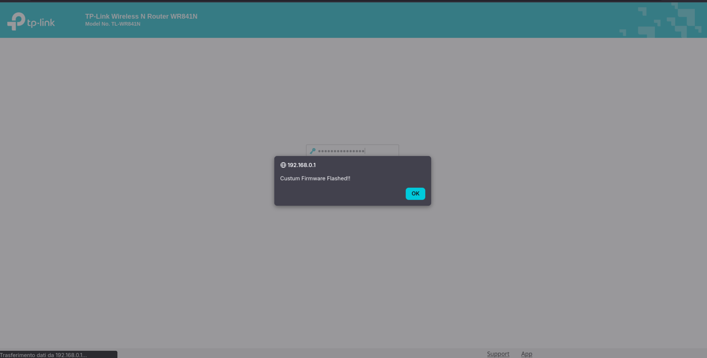

# Firmware flashing methods
We explored two flashing methods:
- Using the router's default web interface
- Using a TFTP server (recovery mode)

## Web interface flash

To flash a custom image from the router web interface you must provide a firmware file that the web update mechanism will accept.
To validate that the firmware extraction was successful we unpacked the firmware with `firmware-mod-kit`, modified the 
web UI in the extracted `rootfs` (for example by editing `rootfs/web/index.htm` and adding `rootfs/web/js/test.js`),
and rebuilt the image using FMK.




We uploaded the rebuilt `.bin` file through the router web interface to confirm the update process accepted and flashed the image.




This verified that `firmware-mod-kit` can rebuild a valid firmware image starting from the original `.bin` rootfs.

## TFTP recovery flash

If the web interface is not available (for example after a brick or during a bootloop), you can force a flash using a
TFTP server. Place a firmware file with the correct filename in the TFTP server root, force the device into recovery mode,
and the router will pull the file and flash it. For the `V14` hardware the recovery filename is `tp_recovery.bin`.

### Install TFTP server on Fedora

Run:

```
sudo dnf install tftp-server tftp -y
sudo cp /usr/lib/systemd/system/tftp.service /etc/systemd/system/tftp-server.service
sudo cp /usr/lib/systemd/system/tftp.socket /etc/systemd/system/tftp-server.socket
```

Edit `/etc/systemd/system/tftp-server.service`  (for example with `nano`) to match:

```
[Unit]
Description=TFTP Server
Requires=tftp-server.socket
Documentation=man:in.tftpd

[Service]
ExecStart=/usr/sbin/in.tftpd -c -p -s /var/lib/tftpboot
StandardInput=socket

[Install]
WantedBy=multi-user.target
Also=tftp-server.socket
```

Save the file, then run:

```
sudo systemctl daemon-reload
sudo systemctl enable --now tftp-server
sudo chmod 777 /var/lib/tftpboot
sudo firewall-cmd --add-service=tftp --permanent
sudo firewall-cmd --reload
```

Notes:
- We intentionally avoid recommending disabling the firewall or SELinux permanently. In some test environments you may temporarily stop `firewalld` or set SELinux to permissive, but do so only briefly and understand the risk.
- TFTP is insecure; do not expose it to untrusted networks.

To place a file in the TFTP root:

```
sudo mv <filename> /var/lib/tftpboot/
```

### Recovery procedure and flashing

For the router to pull the file from the TFTP server, configure the server interface with IP `192.168.0.66` and netmask `255.255.255.0`, and place the file named `tp_recovery.bin` in the TFTP root. Then follow the hardware-specific recovery sequence:

- Disconnect power
- Press and hold the WPS/RESET button
- Reconnect power while holding the button
- Release the button only when the WPS (orange) LED starts flashing rapidly

When in recovery mode the router will attempt to download `tp_recovery.bin` from `192.168.0.66`. You can monitor TFTP transfers with:

```
sudo tcpdump -ni <eth> port 69
```

After the flash completes the device reboots and the web interface should be available at `192.168.0.1`.

The file `scripts/tftp_server.sh` automates the setup process of the TFTP server and the configuration of the interface,
IP address, and recovery files. When the script is executed, after setting up the environment, it runs `tcpdump` on the
specified interface. When interrupted using `Ctrl+c`, it restores the environment by resetting the firewall and SELinux 
modes and removing any unnecessary directories.

Usage:

```
./tftp_server.sh <interfaccia_di_rete> <firmware.bin>
```

### Note: stripped firmware
Unlike the web-update process, TFTP recovery usually expects a stripped firmware image without the boot image. To create a recovery file from a rebuilt firmware you can use:

```
dd if=new-firmware.bin of=tp_recovery.bin skip=1 bs=512
```

Note: see the OpenWRT guide on how to go back to the original firmware: https://openwrt.org/toh/tp-link/tl-wr841nd#go_back_to_original_firmware