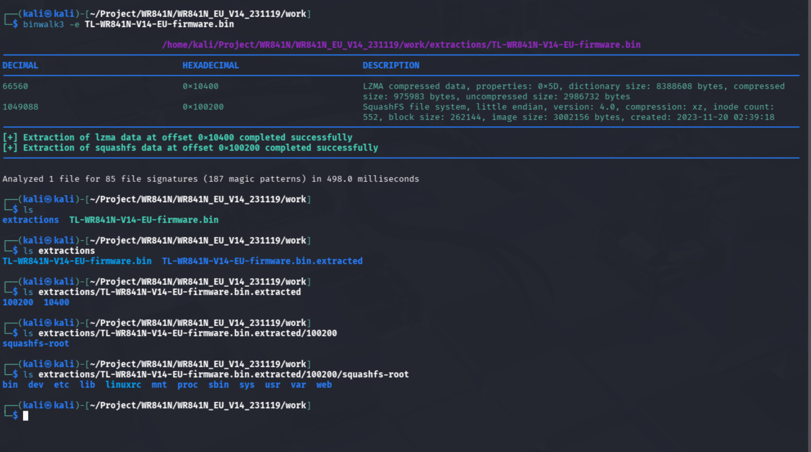

# Static analysis

- Model: `TL-WR841N`
- Hardware version: `V14.1`

This document describes how we obtained and inspected the official TP-Link firmware for the `TL-WR841N` (EU build), and how we tested flashing methods. The original firmware was downloaded from the TP-Link support page: https://www.tp-link.com/it/support/download/tl-wr841n/#Firmware. Always choose the firmware that matches the router model, hardware version and the target region (EU in our case).

## Binwalk
We unpacked the firmware with `binwalk3` to inspect its structure.

You can also use the `firmware-mod-kit` (FMK) suite, which includes `binwalk` and provides utilities to rebuild firmware 
after modifications. `Binwalk` has detected two section in the `.bin` file:
- LZMA compressed data: Lempel-Ziv-Markov-Algorithm is an efficient compression algorithm like `.7z`. Usually, in router firmware, LZMA is used to reduce kernel size to save space in flash memory. So, based on this informations, is reasonable to assume that is the kernel section of the `.bin` file
- SquashFS filesystem: SquashFS is a linux compressed read-only filesystem. It contains the rootfs

## FirmWalker
We have extract the squashfs with `binwalk -e TL-WR841N-V14-EU-firmware.bin`. After that, we have execute `firmwalker` on the extracted file system to search sensitive information. The full `firmwalker` output is available at `scripts/firmwalker-output.txt`. 

The FirmWalker scan highlights several areas of interest:

- Presence of **system account files** (`/etc/passwd`, `passwd.bak`)
- Numerous **web interface components** including login pages, JavaScript encryption routines, and administrative tool pages
- Multiple **networking and tunneling binaries** (PPPoE, PPTP, L2TP, DHCPv6, UPnP)
- Important **embedded system binaries** (BusyBox, Dropbear, httpd)
- Potentially sensitive **configuration scripts** (`config-mii.sh`, `emulate.sh`)
- Hardcoded **IP addresses**, **URLs**, and references to third-party services (DDNS providers)
- Presence of **EEPROM** binary for Wi-Fi chipset configuration
- No direct discovery of shadow password files or Unix-MD5 hashes
- No SSL private keys explicitly exposed in the filesystem

Overall, the filesystem presents a typical embedded Linux environment for TP-Link devices, but includes several legacy components and backup files that merit additional scrutiny.

### System Account Files
FirmWalker identifies:

- `t/etc/passwd`
- `t/etc/passwd.bak`

The standard `passwd` file does not contain password hashes (no `/etc/shadow` file is present), which is common for embedded devices relying on application-level authentication handled by the web server. However, the existence of `passwd.bak` is noteworthy. Backup credential files may expose system accounts if improperly protected in deployments.

### Absence of Hashes
The scan confirms:

- No Unix-MD5 hashes
- No shadow file

This suggests that administrative authentication for the web management interface is implemented in a proprietary manner, typically via JavaScript obfuscation (`tpEncrypt.js`) and backend configuration storage.

### Shell Scripts
The scan identifies:

- `config-mii.sh`
- `emulate.sh`

These scripts may contain network initialization routines or debugging utilities left from development. Given their direct interaction with the system, they should be reviewed for:

- Unsafe command execution
- Hardcoded credentials
- Debug or maintenance backdoors

### Additional Configuration Files
Files such as:

* `/etc/resolv.conf`

Indicate DNS defaults that may influence network behavior but do not appear inherently sensitive.

### Embedded System Biaries
Key binaries detected include:

- `busybox`
- `dropbearmulti`
- `httpd`
- `scp`, `tftp`
- PPP and tunneling daemons (`pppd`, `xl2tpd`, etc.)
- Wi-Fi driver component (`mt_wifi.ko`)

These components collectively form the core networking and management stack of the router. Historically, command injection, buffer overflows, and authentication bypass issues in TP-Link firmware have been associated with:

- Web management binaries (`httpd`)
- PPPoE and tunneling configuration handlers
- Dropbear versions lacking strong key handling

A detailed reverse-engineering pass is recommended to verify the absence of known vulnerabilities.

### EEPROM Binary
The presence of:

- `MT7628_EEPROM_20140317.bin`

contains radio calibration data and regulatory settings. It is not sensitive by itself but confirms the Wi-Fi chipset architecture (MediaTek MT7628), useful for cross-referencing vendor-specific vulnerabilities.

### Web Management Interface Components
The filesystem includes extensive HTML, JavaScript, and help files associated with the router’s administrative web UI. Notable items include:

- Login pages (`frame/login.htm`, `main/password.htm`)
- Management control pages (`manageCtrl.htm`)
- JavaScript support files (`help.js`, `str.js`)
- Encryption routines (`tpEncrypt.js`)

These assets represent critical attack surfaces. Specific areas of concern:

1. Potential for **authentication bypass** via misconfigured access controls
2. **Weak or reversible password obfuscation** in JavaScript
3. **Command injection** vectors in WAN, DDNS, VPN, or Wi-Fi configuration handlers

Because FirmWalker highlights many files containing strings such as “admin”, “root”, and “password”, these should be examined to understand:

- How user credentials are processed
- Whether sensitive data is transmitted securely
- Whether hardcoded logic or backdoor accounts exist

### Networking, Tunneling, and Protocol-Derived Artifacts
The firmware contains numerous files associated with:

- PPPoE, L2TP, PPTP
- DHCPv6 clients/servers
- UPnP (`upnpd`)

These services have a long history of exploitation on embedded devices, especially when their configuration endpoints are exposed through the web interface.

Binary-level review is highly recommended for:

- Format string vulnerabilities
- Buffer overflow conditions
- Unsafe system call wrappers

### IP Addresses
A range of internal and external IP addresses is present, such as:

- Router defaults: `192.168.0.1`
- Alternate LAN subnets: `192.168.15.x`
- External services: `202.96.12.8`

These may be used for:

- Default routing logic
- DDNS updates
- Diagnostics or fallback DNS

Any external IP should be verified to ensure that the router does not communicate with undocumented third-party endpoints.

### URLs
Numerous URLs appear in the filesystem, referencing:

- TP-Link support sites
- DDNS providers (NoIP, Oray)
- Local router access URLs (tplinkwifi.net)

While mostly benign, they represent potential indicators of external service integration, which must be reviewed for:

- Protocol security
- Lack of certificate validation
- Exposure of user credentials to third parties

### Sensitive Ketwords: "secret", "token", "key"
The scan lists binaries such as:

- `rt2860apd`
- `pppd`
- `dhcp6c`
- `xl2tpd`

as containing keywords such as “secret” and “token”. These occurrences may refer to:

- PPP authentication tokens
- WPS/WPA key management routines
- DHCPv6 identity associations

This does not imply the presence of exposed secrets but signals that the binaries should be analyzed with tools such as `strings`, `binwalk`, or Ghidra to confirm that no hardcoded credentials or cryptographic material are embedded.

### Absence of SSL/TLS Keys
FirmWalker did **not** identify:

- `.pem`
- `.key`
- `.crt`

This suggests that the firmware may:

- Use autogenerated keys at runtime, or
- Not use HTTPS for its web interface

The absence of contained keys is positive; however, **lack of HTTPS support is a critical security concern** for administrative interfaces.

### Overall Security Assessment
The filesystem content reflects a typical TP-Link embedded Linux distribution with:

- Legacy components
- Numerous networking utilities
- A custom web interface
- Backup files and administrative scripts
- Third-party service integrations

While FirmWalker does not reveal direct vulnerabilities, several findings increase the need for deeper analysis:

1. Backup credential files (`passwd.bak`)
2. Legacy tunneling and PPP binaries
3. Large attack surface in the web UI
4. Potential weak password obfuscation mechanisms
5. Hardcoded IP addresses and URLs
6. Lack of HTTPS indicators

These elements collectively suggest that the firmware should undergo:

- Manual reverse engineering of `httpd` and authentication modules
- Static analysis of configuration and shell scripts
- Inspection for command injection vectors in form handlers
- Dynamic testing in an emulated environment (e.g., QEMU)